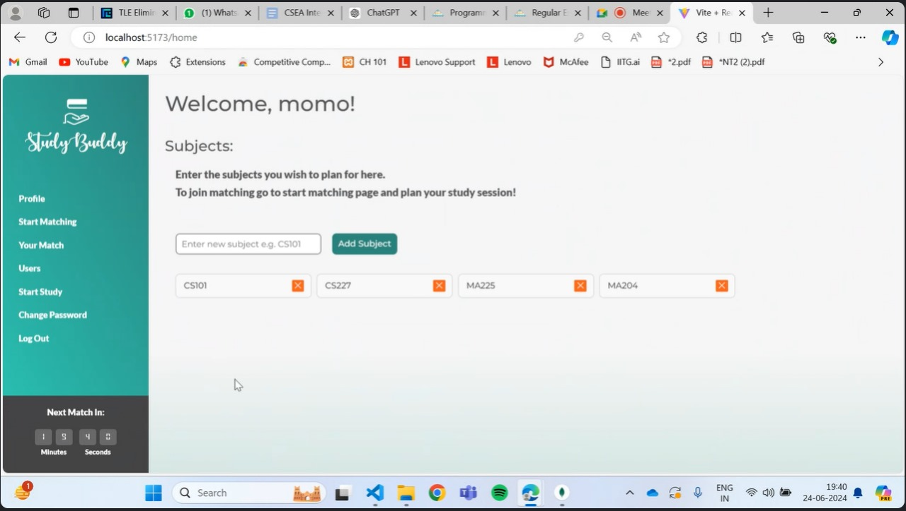
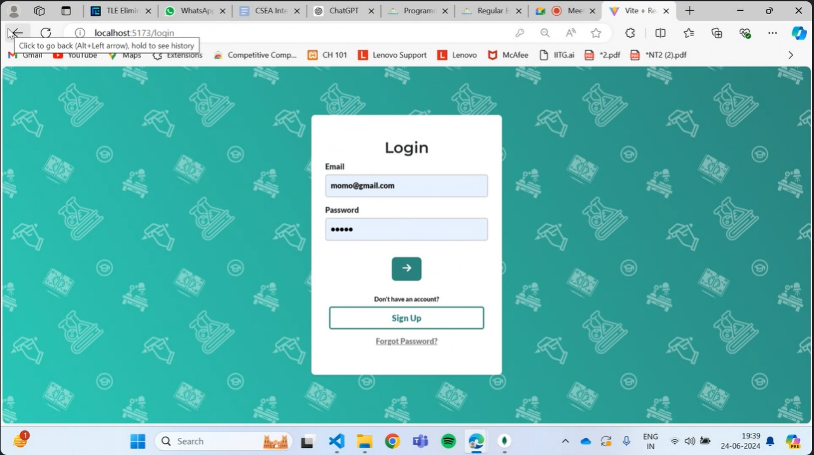
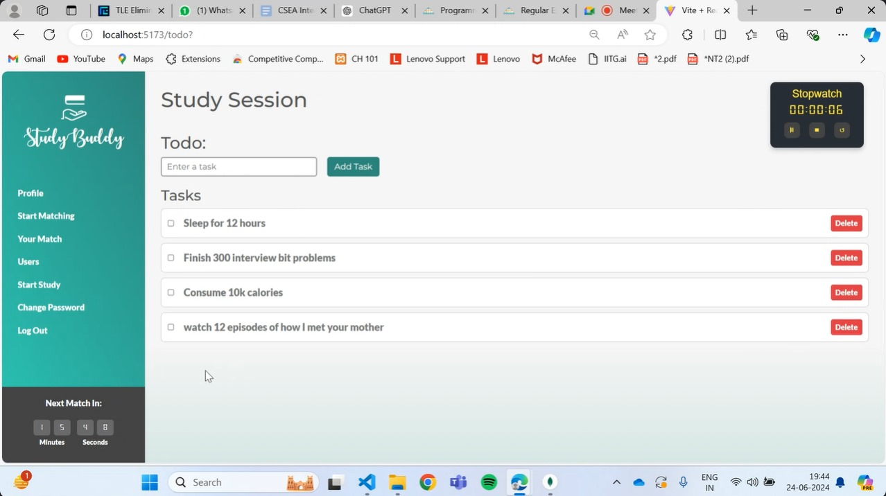
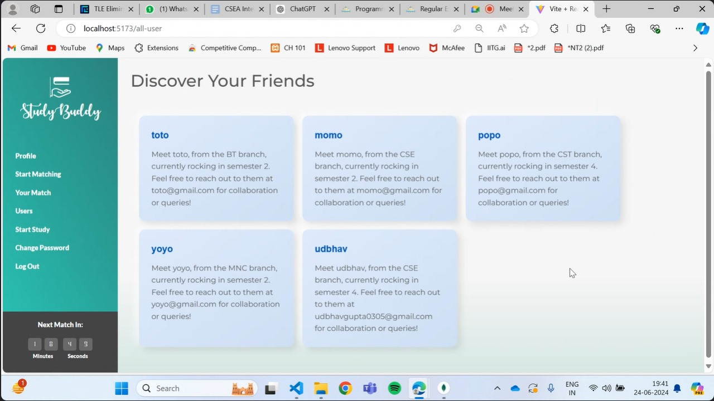
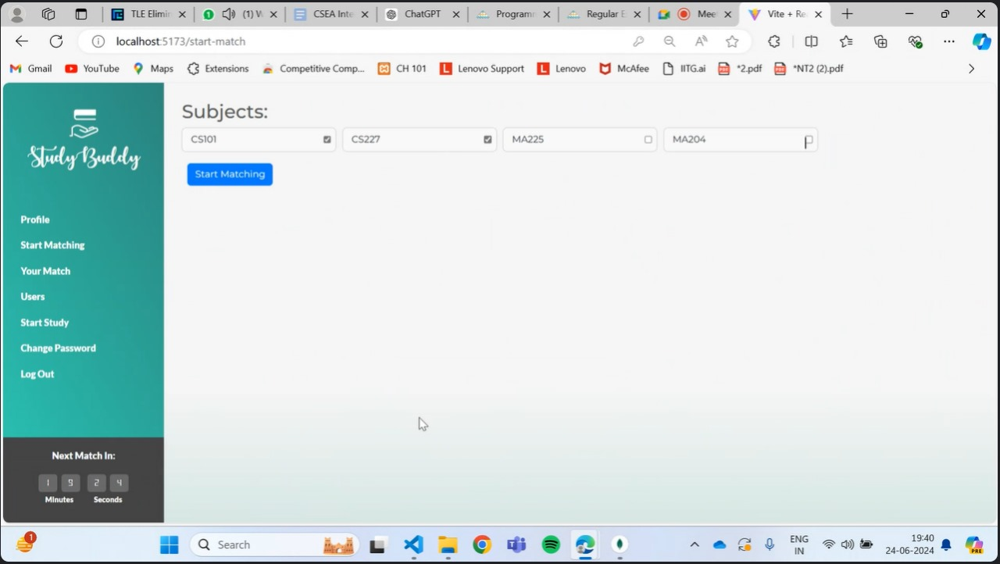
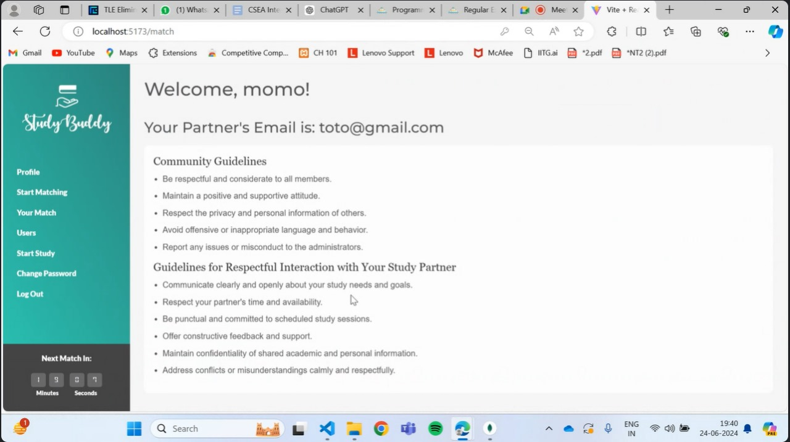
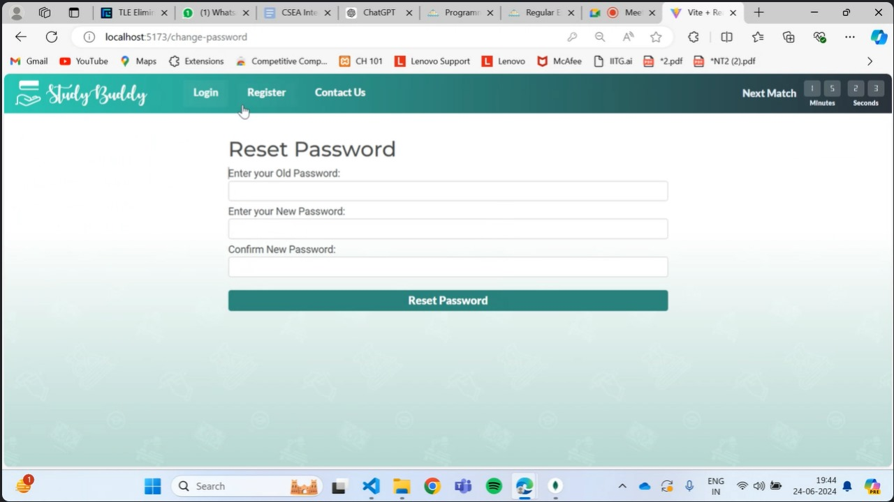

# Study Buddy Finder
[Deployment Link](https://study-buddy-frontend-one.vercel.app/)

The project is a web application designed to facilitate efficient study management and user interaction. It features multiple pages and functionalities tailored for a personalized and secure user experience.

Developed by: 
- Tarun Raj
- Udbhav Gupta
- Tanush Reddy Kolagatla

## Homepage



- Displays user-specific information such as subjects of study, user name, and navigation to relevant pages.
- Allows users to update their subjects and navigate to corresponding pages.

## Login/Register Page



- Provides secure authentication using JWT (JSON Web Tokens) for user login and registration.
- Implements bcrypt for hashing and securely storing passwords.

## Study Session Page



- Includes a dynamic todo list for adding and managing study tasks.
- Integrates a stopwatch to track study session durations, enhancing productivity monitoring.

## User Display Page


- Lists all users registered on the platform, promoting community engagement and networking.

## Start Match Page



- Utilizes the Gale-Shapley algorithm to efficiently match users based on specified criteria, enhancing user interaction and collaboration.

## Match Display Page



- Provides users with guidelines and best practices for utilizing the website effectively and responsibly.

## About Page


- Offers information about the project, its objectives, and the team behind its development.

## Change Password Page



- The Change Password page allows users to securely update their passwords. It utilizes the Nodemailer library for sending password change notifications and ensuring secure communication.

### Functionality

- *Secure Password Update:* Users can update their passwords securely.
- *Notification:* Nodemailer is used to send notifications confirming password changes, ensuring users are informed of any updates to their account security.

## Technologies Used

- *Database:* MongoDB for storing user data securely.
- *Backend:* Node.js for server-side logic.
- *Frontend:* HTML, CSS, and JavaScript for user interface development.
- *Communication:* Nodemailer for secure email communication and password recovery.
- *Security:* JWT for authentication and authorization, bcrypt for password hashing.

## Additional Tools

- *Algorithms:* Gale-Shapley algorithm for efficient user matching.
- *Libraries:* Zod and Axios for data handling and API interactions.

  

## Installation

To get started with the Study Buddy Finder, follow these steps:

1. **Clone the repository:**

   ```bash
   git clone https://github.com/tarun-trj/studyBuddy.git
   cd studyBuddy

2. **Connect to MongoDB:**

   Ensure you have MongoDB installed and running on your system. Update the connection string in your project's configuration file if necessary.

3. **Install server-side dependencies and run the server:**

   ```bash
   npm install
   nodemon index.js

4. **Install client-side dependencies and run the client:**

   The following commands will start the development server and provide you with a link to the website.
   
   ```bash
   cd login_register
   npm install
   npm run dev

## Usage

Once the server and client are running, open the provided link in your browser to access the Study Buddy Finder. Register an account, log in, and start finding study partners!


